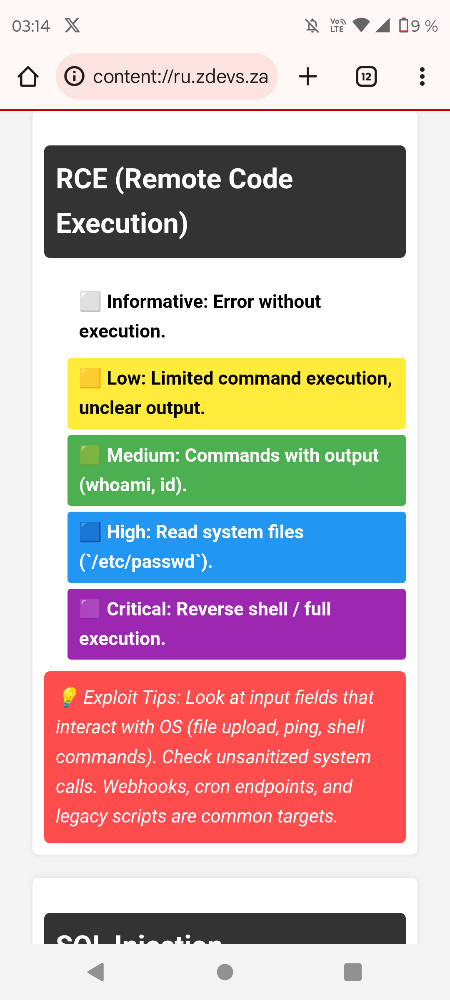

# Bug Bounty Severity Guide

A comprehensive Bug Bounty reference for web vulnerabilities, including severity levels, exploitation tips, endpoints, and common parameters. Perfect for beginners and experienced bug hunters alike.

## Features

- 21 common web vulnerabilities documented
- Severity levels from Informative to Critical
- Guidance on how to test and exploit each vulnerability safely
- Frequently found endpoints and parameters highlighted
- Ready-to-use HTML reference sheet

## How to Use

1. Open `bug_bounty_severity_guide.html` in your browser.
2. Navigate through different vulnerabilities.
3. Use the colored severity boxes to quickly identify impact levels.
4. Follow the exploitation tips for safe testing in Bug Bounty programs.

### Example Screenshot: RCE

**Description:** This screenshot shows the RCE section from the Bug Bounty Severity Guide HTML file. The highlighted area demonstrates how severity levels and exploitation tips are presented. Use this reference responsibly in authorized Bug Bounty programs.

## Contributing

Feel free to submit pull requests or suggestions to improve the guide. Please ensure any updates are safe and non-malicious.

## License

This project is open-source and free to use. No license specified.
